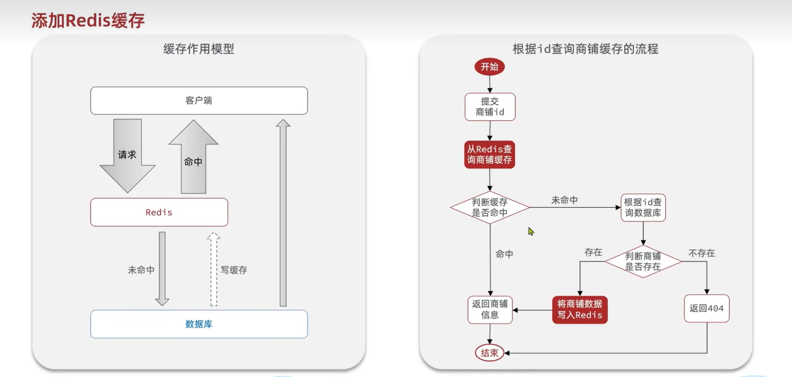
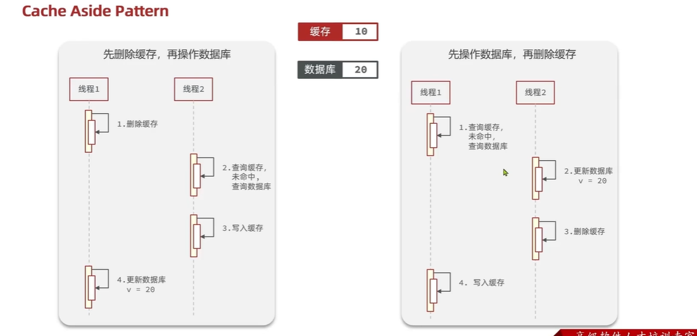
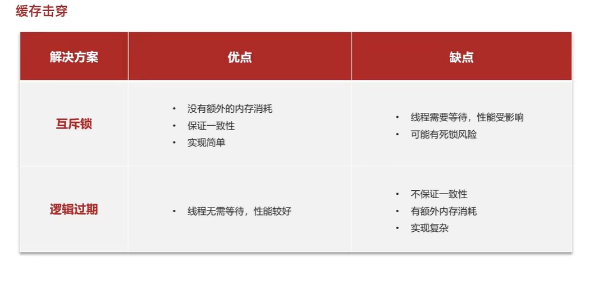
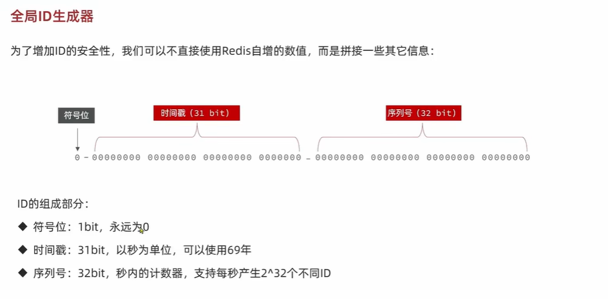
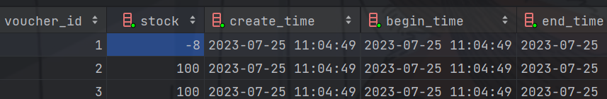
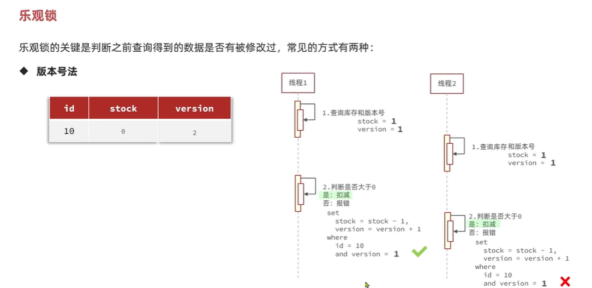
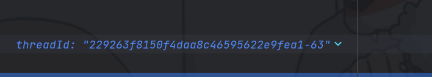

## Redis学习：
### 通用命令
不要在主节点用：keys param 命令来查询，这查询速率很慢，单线程将会被阻塞</br>
del param（可以是多个参数） :删除指定的key</br>
exists param(判断key是否存在)</br>
expire key time :设置有效期时间</br>
ttl key :查看key的有效期</br>

### String类型
最简单的Redis数据类型，value：string,int,float；最大空间不超过512M</br>
set key value
get key

Mset 批量 添加key-value

Mget批量获取

数值类型：incr ：让变量自增加一

incrby  num：按照步长增加

setnx:不存在 key才可以添加这个key

### 如何区分不同的key？

利用层级结构来表明table，以后的大部分业务都是用层级结构来展现和布局的！


### Hash类型

哈希类型，也叫做散列，Hash的value是一个无须字典，类似于HashMap的结构。


具有field这一个字段，这是不一样的。

### List类型

类似于 LinkedList(也就是双向链表)

- 有序 
- 元素可重复
- 插入删除快
- 查询速度一般

Lpush key element：向左侧插入元素 返回列表长度，相应的向右边：Rpush key element

Lpop key:移除左侧第一个元素，没有则返回nil

Blop/Brpop key times:阻塞队列的插入 ,加上阻塞时间


如何用List来模拟栈？

入口和出口一起。Lpush和Lpop

模拟队列？

入口和出口不在一起。Lpush和Rpop

模拟阻塞队列？

入口出口不在一边，取的时候用阻塞Brpop/Blpop

### Set类型

类似于HashSet，可以看作是value为null的hashMap。


Sadd key member:添加一个或多个元素。

Srem key member:删除元素

Smembers：获取所有元素

Sinter key1 key2:求取交集

Sdiff：求差集

Sunion:求并集

Scard:求元素个数


Sismenber key member:是否是成员

### SortedSet


zrank key  member:排名从0开始计算

zcount key min max:统计区间数量


## <hr/>
## Redis实际开发时序列化的问题


## Session共享问题，基于Redis实现的Session数据数据共享

多台Tomcat服务器，每一台都有不同的Session空间，将会存在共享问题,互相拷贝具有时间延迟和空间浪费的问题。


> 解决方案：Redis数据共享

> code作为key显然是不行的，将会覆盖，所有选用Phone作为key，使用Hash结构来存储，
> 内存占用也会比较少相对于String类型，使用随机token作为key来存储用户信息。
> 现在token作为登录凭证，返回token给客户端


>缓存：浏览器缓存->应用层缓存（Redis，Nginx,Tomcat...各种缓存）->数据库缓存，根据索引来进行缓存，减少磁盘IO

优点：降低后端负载，提高读写速率，降低响应时间
成本：数据一致性成本，当数据库发生改变时，缓存未跟新，就会出现不一致，
代码维护成本也会提高，为了高可用，运维成本也会提高



## 缓存更新策略：
内存淘汰，超时剔除(低一致性)，主动更新（高一致性）


> 主动更新：
> 
> 1调用者更新数据库时同时更新缓存；（可控性最高）
> 
> 2 缓存和数据库整合为一个服务；
> 
> 3 调用只操作，独立异步线程持久化到数据库,从而实现缓存和数据库一致

> 删除缓存（无效操作太多）而不是更新缓存，单体项目需要将缓存和数据库放在一个事务，考虑线程安全
> Cache Aside Pattern（解决线程安全问题）
> 

### 缓存穿透：
_请求客户端数据中，缓存里面和数据库里面数据都不存在，请求都打到数据库上面了_
>解决办法：布隆过滤器（内存占用少），缓存空对象或者null（额外内存消耗，可能造成短期不一致）
> 
>主动添加 对ID的复杂度

### 缓存雪崩

> 
> 很多key同时失效

### 缓存击穿
>热点key突然失效，无效热点数据给数据库带来巨大压力
>
> 1：使用互斥锁来写入缓存，但是互相等待时间比较长，性能较差
> 
> 2：逻辑过期TTL=-1
> 
> 
> 
> 

选择一致性还是可用性

> 全局唯一 ID生成器


UUID：没有满足特性 ，RedisId：数字类型，snowflake：算法，维护机器ID

### 多线程下高并发超卖问题是怎么发生的

> 
> 
> 
> 
当线程扣减时候，多线程查询库存，扣减库存之前，直接一个数据用两次，使得出现并发安全问题。

## 锁的介绍：
### 悲观锁：

> 悲观锁
>
> 例如synchronized 和lock，认为线程安全问题一定会发生，在操作数据之前一定要获得锁之后才执行

> 乐观锁
> 
> 认为线程安全问题不一定会发生，多数情况不发生，不加锁，
> 在线程做数据更新时进行数据判断，看之前的判断数据是否发生修改，性能相较于乐观锁好

> 那怎么判断之前的数据是否发生了修改呢？

1：版本号法（最广泛）
给数据加上版本号，同时在修改时不仅要查询版本号同时还要修改版本号



2：CAS方法，假如数据本身具有变化，那么数据本深就可以作为版本号

3：分段锁，解决成功率较低的问题，实际秒杀还要对秒杀进行优化，不对数据库造成压力

> 集群模式下的并发安全问题：
> 
> 当出现集群和负载均衡时，可能出现交叉执行，锁失效了，这就是分布式来解决这个问题
> 
> 锁监视器不是同一个
> 
> 出现了两套JVM，锁监视器具有不同的，这将会导致出现并发安全问题
> 
> ==》解决办法：分布式锁
### 一人一单

## 分布式锁

实现原理：不同的JVM采用同一个JVM

分布式锁特点：多进程可见同时时互斥的锁，高可用性，高并发（高性能），安全性，是否会产生死锁

是否满足可重入性？（不是重点）

> 分布式锁的实现
> 
> 实现方式：Mysql Redis Zookeeper
> 
> mysql:利用mysql本身的互斥锁机制，redis:利用setnx这样的互斥命令，利用key的过期时间来解决安全问题。
> 
> zookeeper 利用唯一节点和有序性来实现互斥锁。高可用性还是比较好的，安全性较好

## 基于Redis实现分布式锁：


```shell
127.0.0.1:6379> help set

  SET key value [EX seconds|PX milliseconds|EXAT timestamp|PXAT milliseconds-timestamp|KEEPTTL] [NX|XX] [GET]
  summary: Set the string value of a key
  since: 1.0.0
  group: string

127.0.0.1:6379> set lock thread EX 10 NX
OK
127.0.0.1:6379> set lock thread EX 10 NX
(nil)
127.0.0.1:6379> ttl lock
(integer) -2

```

实现将会是非阻塞式的分布式锁


极端情况线程出现并发安全问题。


解决办法：释放锁的时候需要进行检查，看自己的锁标识是否和之前获取的一样。




只要redis锁发生了超时释放就有可能发生并发问题。

例如FullGc时，发生阻塞就会出现并发问题，所以释放锁和判断锁标识必须是原子性的，必须同时

### 用Lua脚本来解决原子性问题


## Redisson问题(呵呵，这是一个把分布式锁实现好的开源框架)


## redisson 分布式锁原理：


可重入：利用hash结构来记录线程id和重入次数，类似于ReentryLock

可重试：利用信号量实现等待和获取锁失败的重试机制

超时续约：利用看门狗，在获取锁之后，每隔一段时间，就自动续约，锁满血复活。

### 分布式锁的主从一致性问题。

利用redisson的multilock来实现


### 利用Redis来优化秒杀
使用Set类型，解决唯一性问题。lua脚本来解决锁释放和事务提交的原子性问题


